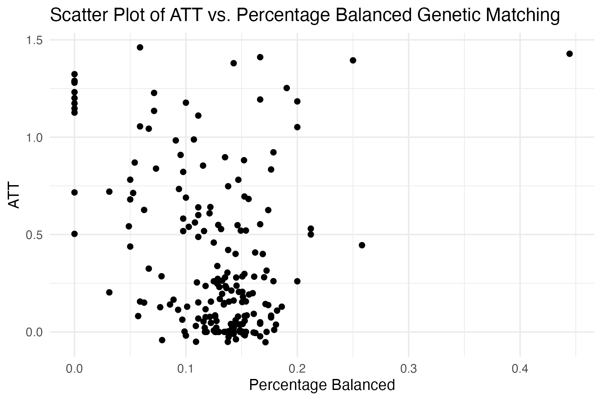
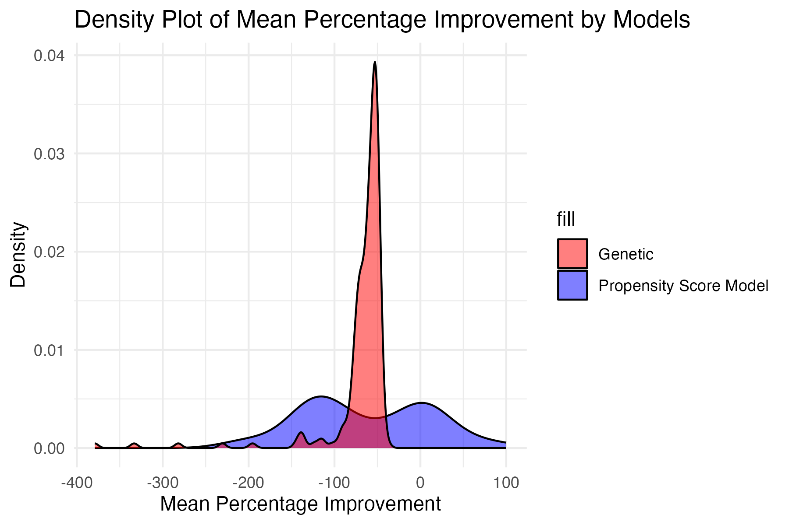

# Introduction

In this project, you will explore the question of whether college education causally affects political participation. Specifically, you will use replication data from \href{https://papers.ssrn.com/sol3/papers.cfm?abstract_id=1409483}{Who Matches? Propensity Scores and Bias in the Causal Effects of Education on Participation} by former Berkeley PhD students John Henderson and Sara Chatfield. Their paper is itself a replication study of \href{https://www.jstor.org/stable/10.1017/s0022381608080651}{Reconsidering the Effects of Education on Political Participation} by Cindy Kam and Carl Palmer. In their original 2008 study, Kam and Palmer argue that college education has no effect on later political participation, and use the propensity score matching to show that pre-college political activity drives selection into college and later political participation. Henderson and Chatfield in their 2011 paper argue that the use of the propensity score matching in this context is inappropriate because of the bias that arises from small changes in the choice of variables used to model the propensity score. They use \href{http://sekhon.berkeley.edu/papers/GenMatch.pdf}{genetic matching} (at that point a new method), which uses an approach similar to optimal matching to optimize Mahalanobis distance weights. Even with genetic matching, they find that balance remains elusive however, thus leaving open the question of whether education causes political participation.

You will use these data and debates to investigate the benefits and pitfalls associated with matching methods. Replication code for these papers is available online, but as you'll see, a lot has changed in the last decade or so of data science! Throughout the assignment, use tools we introduced in lab from the \href{https://www.tidyverse.org/}{tidyverse} and the \href{https://cran.r-project.org/web/packages/MatchIt/MatchIt.pdf}{MatchIt} packages. Specifically, try to use dplyr, tidyr, purrr, stringr, and ggplot instead of base R functions. While there are other matching software libraries available, MatchIt tends to be the most up to date and allows for consistent syntax.

# Data

The data is drawn from the \href{https://www.icpsr.umich.edu/web/ICPSR/studies/4023/datadocumentation#}{Youth-Parent Socialization Panel Study} which asked students and parents a variety of questions about their political participation. This survey was conducted in several waves. The first wave was in 1965 and established the baseline pre-treatment covariates. The treatment is whether the student attended college between 1965 and 1973 (the time when the next survey wave was administered). The outcome is an index that calculates the number of political activities the student engaged in after 1965. Specifically, the key variables in this study are:

\begin{itemize}
    \item \textbf{college}: Treatment of whether the student attended college or not. 1 if the student attended college between 1965 and 1973, 0 otherwise.
    \item \textbf{ppnscal}: Outcome variable measuring the number of political activities the student participated in. Additive combination of whether the student voted in 1972 or 1980 (student\_vote), attended a campaign rally or meeting (student\_meeting), wore a campaign button (student\_button), donated money to a campaign (student\_money), communicated with an elected official (student\_communicate), attended a demonstration or protest (student\_demonstrate), was involved with a local community event (student\_community), or some other political participation (student\_other)
\end{itemize}

Otherwise, we also have covariates measured for survey responses to various questions about political attitudes. We have covariates measured for the students in the baseline year, covariates for their parents in the baseline year, and covariates from follow-up surveys. \textbf{Be careful here}. In general, post-treatment covariates will be clear from the name (i.e. student\_1973Married indicates whether the student was married in the 1973 survey). Be mindful that the baseline covariates were all measured in 1965, the treatment occurred between 1965 and 1973, and the outcomes are from 1973 and beyond. We will distribute the Appendix from Henderson and Chatfield that describes the covariates they used, but please reach out with any questions if you have questions about what a particular variable means.

```{r}
# Load tidyverse and MatchIt
# Feel free to load other libraries as you wish
library(tidyverse)
library(MatchIt)


# Load ypsps data
ypsps <- read_csv('data/ypsps.csv')
head(ypsps)
```

# Randomization

Matching is usually used in observational studies to to approximate random assignment to treatment. But could it be useful even in randomized studies? To explore the question do the following:

\begin{enumerate}
    \item Generate a vector that randomly assigns each unit to either treatment or control
    \item Choose a baseline covariate (for either the student or parent). A binary covariate is probably best for this exercise.
    \item Visualize the distribution of the covariate by treatment/control condition. Are treatment and control balanced on this covariate?
    \item Simulate the first 3 steps 10,000 times and visualize the distribution of treatment/control balance across the simulations.
\end{enumerate}

```{r message=FALSE}

# libraries
xfun::pkg_attach2(c("tidyverse", # load all tidyverse packages
                    "here",      # set file path
                    "MatchIt",   # for matching
                    "optmatch",  # for matching
                    
                    "cobalt"))   # for matching assessment


# chunk options ----------------------------------------------------------------
knitr::opts_chunk$set(
  warning = FALSE            # prevents warning from appearing after code chunk
)

# prevent scientific notation
# ----------
options(scipen = 999)
```


```{r here}
here::i_am('Project 6 Template.Rmd') # declare where you are -- "library:function"  allows you to run a function without loading it
library(here)                 # loading the library  - don't use require

# install libraries 
# ----------
here()                        # setting working directory as the relative file path
setwd(here())   
```


```{r data}

# installing libraries 
# ----------
library(readr)


# load dataa
# ----------
df <- read_csv(here("data/ypsps.csv")) # here() essentially is the working directory
head(df)
names(df)  # shows you the column names 
dim(df)

#?read_csv  #check documentation 
```

```{r Q3}
set.seed(1234)

# Generate a vector that randomly assigns each unit to treatment/control
n <- nrow(df) 

# I will assing a variable 0 for control and 1 for treatment 
df$random_treat <- sample(c(0, 1), n, replace = TRUE)
df$random_treat <- as.factor(df$random_treat)

# Choose a baseline covariate (use dplyr for this)
student_Phone_var <- df %>%
  group_by(random_treat) %>%
  summarise(student_Phone_mean = mean(student_Phone))

# Visualize the distribution by treatment/control (ggplot)

#   bar plot
ggplot(student_Phone_var, aes(x = random_treat, y = student_Phone_mean, fill = random_treat)) +
  geom_bar(stat = "identity") +
  theme_minimal() +
  labs(title = "Average Student has Phone by Treatment Status",
       x = "Treatment Status",
       y = "Average Student has Phone (Proportion of Yes)") +
  scale_fill_brewer(palette = "Set1", name = "Treatment Status")


#Doing a Chi2 test
table_data <- table(df$student_Phone, df$random_treat)
chi2_result <- chisq.test(table_data)

# and a ttest 
t.test( student_Phone~ random_treat, data = df)

#No statistical difference, thus no difference in the distribution 


# Simulate this 10,000 times (monte carlo simulation - see R Refresher for a hint)

n_iterations <- 10000

#we will store results 
results <- data.frame(iteration = integer(n_iterations),
                      chi2_p_value = numeric(n_iterations),
                      ttest_p_value = numeric(n_iterations),
                      treatment_mean = numeric(n_iterations),
                      control_mean = numeric(n_iterations),
                      mean_differences <- numeric(n_iterations))

for (i in 1:n_iterations) {
# I will assing a variable 0 for control and 1 for treatment 
df$random_treat <- sample(c(0, 1), n, replace = TRUE)
df$random_treat <- as.factor(df$random_treat)

# Choose a baseline covariate (use dplyr for this)
student_Phone_var <- df %>%
  group_by(random_treat) %>%
  summarise(student_Phone_mean = mean(student_Phone))

  # Store means
  results$treatment_mean[i] <- student_Phone_var$student_Phone_mean[df$random_treat == 1]
  results$control_mean[i] <- student_Phone_var$student_Phone_mean[df$random_treat == 0]

  # Chi-squared test
  table_data <- table(df$student_Phone, df$random_treat)
  chi2_result <- chisq.test(table_data)
  results$chi2_p_value[i] <- chi2_result$p.value

  # T-test
  ttest_result <- t.test(student_Phone ~ random_treat, data = df)
  results$ttest_p_value[i] <- ttest_result$p.value

    # Calculate the difference in means 
  treatment_mean <- student_Phone_var$student_Phone_mean[df$random_treat == 1]
  control_mean <- student_Phone_var$student_Phone_mean[df$random_treat == 0]
  mean_differences[i] <- treatment_mean - control_mean
  
  
  # iteration number
  results$iteration[i] <- i
}


mean(results$chi2_p_value < 0.05)
mean(results$ttest_p_value < 0.05)

# Analyze the balance of the variable
mean_difference_test <- t.test(mean_differences)
mean_difference_test
```

```{r}
# Visualize the balance of the variable
dist_studphone <- ggplot(data.frame(MeanDifference = mean_differences), aes(x = MeanDifference)) +
  geom_density(fill = "blue", alpha = 0.5) +
  geom_vline(xintercept = mean(mean_differences), linetype = "dashed", color = "red") +
  labs(title = "Balance of Student has Phone Across All Iterations",
       x = "Difference in Means (Treatment - Control)",
       y = "Density") +
  theme_minimal()
dist_studphone
```

 Questions
\begin{enumerate}
    \item \textbf{What do you see across your simulations? Why does independence of treatment assignment and baseline covariates not guarantee balance of treatment assignment and baseline covariates?}
\end{enumerate}

Your Answer: My graph is showing that the difference of the mean of the variable student having a phone, is centered at $0$, which means that it could be that by pure chance we can end up having no difference in most of the times. Also, it shows that there will be some cases where the mean will be higher or lower than zero, following a normal distribution. It also means that even with independence of treatment some cases will be unbalanced, although all the distribution is contained within the threshold of $0.1$ It is important to recognize that depending on the underlying distribution of the data, even with randommization there could be inbalances on some covariates. 

# Propensity Score Matching

## One Model
Select covariates that you think best represent the "true" model predicting whether a student chooses to attend college, and estimate a propensity score model to calculate the Average Treatment Effect on the Treated (ATT). Plot the balance of the top 10 (or fewer if you select fewer covariates). Report the balance of the p-scores across both the treatment and control groups, and using a threshold of standardized mean difference of p-score $\leq .1$, report the number of covariates that meet that balance threshold.

```{r message=FALSE}
# Select covariates that represent the "true" model for selection, fit model
#variable_names <- names(df)
#df_variable_names <- data.frame(VariableName = variable_names)

select_variables <- c("student_PubAff" , 
"student_Newspaper" , 
"student_Radio" , 
"student_TV" , 
"student_Magazine" , 
"student_FamTalk" , 
"student_FrTalk" , 
"student_AdultTalk" , 
"student_PID" , 
"student_SPID" , 
"student_GovtOpinion" , 
"student_Cynic" , 
"student_StrOpinion" , 
"student_TrOthers" , 
"student_Trust" , 
"student_Senate" , 
"student_Tito" , 
"student_Court" , 
"student_Govern" , 
"student_CCamp" , 
"student_FDR" , 
"student_Knowledge" , 
"student_NextSch" , 
"student_GPA" , 
"student_SchPublish" , 
"student_Phone" , 
"student_Gen" , 
"student_Race" , 
"parent_Newspaper" , 
"parent_Radio" , 
"parent_TV" , 
"parent_Magazine" , 
"parent_TrOthers" , 
"parent_OthHelp" , 
"parent_OthFair" , 
"parent_PolClub" , 
"parent_Button" , 
"parent_Money" , 
"parent_Participate1" , 
"parent_Participate2" , 
"parent_GovtOpinion" , 
"parent_Employ" , 
"parent_EducHH" , 
"parent_EducW" , 
"parent_CivicOrg" , 
"parent_HHInc" , 
"parent_OwnHome" , 
"parent_Senate" , 
"parent_Tito" , 
"parent_Court" , 
"parent_Govern" , 
"parent_CCamp" , 
"parent_Knowledge" , 
"parent_Gen" , 
"parent_Race"  )

ps_formula <- as.formula(paste("college ~", paste(select_variables, collapse = " + ")))

match_ps_att <-matchit(formula = ps_formula, data = df,  # formula
                          method = "nearest", # method
                          distance = "glm", 
                          discard = "control" ,
                          replace = TRUE , 
                         ratio = 2) # estimand
# summary
summary(match_ps_att, un = FALSE )

match_ps_att_data <- match.data(match_ps_att)   

att_formula <- as.formula(paste("student_ppnscal ~ college +", paste(select_variables, collapse = " + ")))

lm_ps_att <- lm(att_formula, data = match_ps_att_data, weights = weights )

lm_ps_att_summ <- summary(lm_ps_att)
lm_ps_att_summ

ATT_ps <- lm_ps_att_summ$coefficients["college", "Estimate"]
ATT_ps

# BALANCE 
balance_table <- bal.tab(match_ps_att, un = FALSE)
# Ensure we are accessing the standardized mean differences correctly
effect_sizes <- abs(balance_table$Balance$Diff.Adj)
names(effect_sizes) <- rownames(balance_table$Balance)

# Step 2: Identify the Top 10 Covariates Based on Effect Size
top_10_covariates <- names(sort(effect_sizes, decreasing = TRUE)[1:10])
print(top_10_covariates)


# Step 3: Create a Love Plot for Top 10 Covariates
love.plot(match_ps_att, thresholds = c(m = 0.1), stars="raw", drop.distance = TRUE, var.order="adjusted")

# Assess the Balance
# Recheck the balance table for the selected top 10 covariates
balance_table_selected <- bal.tab(match_ps_att, vars = top_10_covariates, un = FALSE)
# Checking the number of covariates with SMD ≤ 0.1 among the top 10
balanced_covariates <- sum(abs(balance_table_selected$Balance$Diff.Adj) <= 0.1)
balanced_covariates


```

## Simulations

Henderson/Chatfield argue that an improperly specified propensity score model can actually \textit{increase} the bias of the estimate. To demonstrate this, they simulate 800,000 different propensity score models by choosing different permutations of covariates. To investigate their claim, do the following:

\begin{itemize}
    \item Using as many simulations as is feasible (at least 10,000 should be ok, more is better!), randomly select the number of and the choice of covariates for the propensity score model.
    \item For each run, store the ATT, the proportion of covariates that meet the standardized mean difference $\leq .1$ threshold, and the mean percent improvement in the standardized mean difference. You may also wish to store the entire models in a list and extract the relevant attributes as necessary.
    \item Plot all of the ATTs against all of the balanced covariate proportions. You may randomly sample or use other techniques like transparency if you run into overplotting problems. Alternatively, you may use plots other than scatterplots, so long as you explore the relationship between ATT and the proportion of covariates that meet the balance threshold.
    \item Finally choose 10 random models and plot their covariate balance plots (you may want to use a library like \href{https://cran.r-project.org/web/packages/gridExtra/index.html}{gridExtra} to arrange these)
\end{itemize}

\textbf{Note: There are lots of post-treatment covariates in this dataset (about 50!)! You need to be careful not to include these in the pre-treatment balancing. Many of you are probably used to selecting or dropping columns manually, or positionally. However, you may not always have a convenient arrangement of columns, nor is it fun to type out 50 different column names. Instead see if you can use dplyr 1.0.0 functions to programatically drop post-treatment variables (\href{https://www.tidyverse.org/blog/2020/03/dplyr-1-0-0-select-rename-relocate/}{here} is a useful tutorial).}

```{r}
# Remove post-treatment covariates
# I will also remove interview id and rows that have missing variables 
baseline_vars <- colnames(ypsps)[!grepl("1973", colnames(ypsps)) &
                                 !grepl("1982", colnames(ypsps)) &
                                 colnames(ypsps) != "interviewid" &
                                 colnames(ypsps) != "student_ppnscal"]

# Remove rows with missing values in the selected columns
ypsps_clean <- ypsps[complete.cases(ypsps[, baseline_vars]), ]


# Print the filtered list of variable names
print(baseline_vars)


# Randomly select features
# I tried with more iterations, but after a while having to rerun the code as I was debugging I had to settle with 100, to keep it real. 
set.seed(123)  
n_iterations <- 100
results <- vector("list", n_iterations)

data_simulation <- data.frame(run_id = integer(),
                              n_covar = integer(),
                              ATT = double(),
                              pct_balanced = double(), 
                              mean_pct_impr=double())


for (i in 1:n_iterations) {
  # Randomly select a number of variables from baseline_vars
  n_vars <- sample(1:length(baseline_vars), 1)
  selected_vars <- sample(baseline_vars, n_vars)

  # Create and perform matching using selected_vars
  formula_str <- paste("college ~", paste(selected_vars, collapse = " + "))
  formula <- as.formula(formula_str)
  matchit_res <- matchit(formula, data = ypsps_clean, method = "nearest" , 
                         distance = "glm",# use glm, which by default is logistic regression
                         link = "logit",# specify we want a logit model, default when distance is specified
                         estimand="ATT",
                         discard = "control",# obs to be discarded that are outside region of common support
                         replace = TRUE,# whether matching should be done with replacement
                         ratio = 2)

  # Estimate ATT using linear regression on the matched data
  matched_data <- match.data(matchit_res)
  lm_formula <- as.formula(paste("student_ppnscal ~ college +", paste(selected_vars, collapse = " + ")))
  att_model <- lm(lm_formula, data = matched_data, weights=weights)
  att <- coef(summary(att_model))["college", "Estimate"]

  
  # Calculate the proportion of covariates with SMD ≤ 0.1 and mean percent improvement in SMD
  balance<- bal.tab(matchit_res , binary="std", m.threshold=0.1 )
  df_balance <- as.data.frame(balance$Balance$M.Threshold)
  
  n_total <- nrow(df_balance)
  n_balanced <- length(df_balance[which(balance$Balance$M.Threshold == "Balanced, <0.1"),])
  pct_balanced <- (n_balanced/n_total)
  
   #Calculate the mean of the improvement 
matchit_summary <- summary(matchit_res, improvement = TRUE)

# Extract the reduction in standardized mean differences
improvement_data <- matchit_summary$reduction

smd_reduction <- improvement_data[,"Std. Mean Diff."]

# Calculate mean percent 
mean_percent_improvement <- mean(smd_reduction, na.rm = TRUE)


  # put all this into a dataframe
  data_sim <- data.frame(run_id = i,
                          n_covar = n_vars,
                          ATT = att,
                          pct_balanced = pct_balanced, 
                         mean_pct_impr=mean_percent_improvement)

  data_simulation <- rbind(data_simulation, data_sim)
  
 results[[i]] <- list(
    formula = formula_str,
    ATT = att,
    mean_improvement_smd = mean_percent_improvement,
    model = matchit_res
  )
}


pct_balanced_sim_mean <- mean(data_simulation$pct_balanced)
pct_balanced_sim_mean
# Simulate random selection of features 10k+ times

# Fit p-score models and save ATTs, proportion of balanced covariates, and mean percent balance improvement

# Plot ATT v. proportion

ggplot(data_simulation, aes(x =pct_balanced, y = ATT)) + 
  geom_point() +  # Add points
  theme_minimal() +  # Use a minimal theme for aesthetics
  labs(x = "Percentage Balanced", y = "ATT", 
       title = "Scatter Plot of ATT vs. Percentage Balanced")

```


```{r  fig.width=10, fig.height=15 }
# 10 random covariate balance plots (hint try gridExtra)


set.seed(456) 
selected_indices <- sample(length(results), 10)
selected_models <- results[selected_indices]

library(gridExtra)

plot_list <- lapply(selected_models, function(model) {
  # Extract the matchit object
  matchit_obj <- model$model
  
  # Create the Love plot
  p <- love.plot(matchit_obj, print = FALSE, drop.distance = TRUE, thresholds = c(m = 0.1))  
  return(p)
})

# Arrange the plots in a grid
grid.arrange(grobs = plot_list, ncol = 2)


# Note: ggplot objects are finnicky so ask for help if you're struggling to automatically create them; consider using functions!
```

## Questions

\begin{enumerate}
    \item \textbf{How many simulations resulted in models with a higher proportion of balanced covariates? Do you have any concerns about this?}
    Your Answer: In the first model we had $32/55=58\%$ of balanced covariates, in the simulations it was 40% 
    \item \textbf{Analyze the distribution of the ATTs. Do you have any concerns about this distribution?}
    Your Answer:Yes, the ATT increases as the percentage of balanced covariates increases, which can make the model results very weak to specifications of the matching that lead to different covariate balances. 
    \item \textbf{Do your 10 randomly chosen covariate balance plots produce similar numbers on the same covariates? Is it a concern if they do not?}
    Your Answer:It is not easy to see, but honestly I expect that this might change a lot depending of the inclusion of the variables, and specifications. Again this aligns with the idea that psm is prone to mispecification.  
\end{enumerate}

# Matching Algorithm of Your Choice

## Simulate Alternative Model

Henderson/Chatfield propose using genetic matching to learn the best weights for Mahalanobis distance matching. Choose a matching algorithm other than the propensity score (you may use genetic matching if you wish, but it is also fine to use the greedy or optimal algorithms we covered in lab instead). Repeat the same steps as specified in Section 4.2 and answer the following questions:

```{r error=FALSE }
#alternative model 

# I will also remove interview id and rows that have missing variables 
baseline_vars <- colnames(ypsps)[!grepl("1973", colnames(ypsps)) &
                                 !grepl("1982", colnames(ypsps)) &
                                 colnames(ypsps) != "interviewid" &
                                 colnames(ypsps) != "student_ppnscal"]

# Remove rows with missing values in the selected columns
ypsps_clean <- ypsps[complete.cases(ypsps[, baseline_vars]), ]


# Print the filtered list of variable names
#print(baseline_vars)

# I will comment all to avoid running all again . 
# Randomly select features

#set.seed(546)  

# It tried running a 1000, it was too much. I stopped the code at 198. Ill do the analysis with that. 
#n_iterations <- 198
#data_simulation2 <- data.frame(run_id = integer(),
                        #      n_covar = integer(),
                        #      ATT = double(),
                        #      pct_balanced = double(),
                         #     mean_pct_impr = double())


#for (i in 1:n_iterations) {
  # Randomly select a number of variables from baseline_vars
 # n_vars <- sample(1:length(baseline_vars), 1)
 # selected_vars <- sample(baseline_vars, n_vars)

  # Create and perform matching using selected_vars
  #formula_str <- paste("college ~", paste(selected_vars, collapse = " + "))
  #formula <- as.formula(formula_str)
  #matchit_res2 <- matchit(formula, data = ypsps_clean, method = "genetic" , 
                  #       distance = "glm",# use glm, which by default is logistic regression
                    #     link = "logit",# specify we want a logit model, default when distance is specified
                    #     estimand="ATT",
                    #     discard = "none",# obs to be discarded that are outside region of common support
                         # whether matching should be done with replacement
                     #    ratio = 1)

  # Estimate ATT using linear regression on the matched data
 # matched_data2 <- match.data(matchit_res2)
 # lm_formula <- as.formula(paste("student_ppnscal ~ college +", paste(selected_vars, collapse = " + ")))
  #att_model2 <- lm(lm_formula, data = matched_data2, weights=weights)
  #att2 <- coef(summary(att_model2))["college", "Estimate"]

  
  # Calculate the proportion of covariates with SMD ≤ 0.1 and mean percent improvement in SMD
  #balance2<- bal.tab(matchit_res2 , binary="std", m.threshold=0.1 )
 # df_balance2 <- as.data.frame(balance2$Balance$M.Threshold)
  
#  n_total2 <- nrow(df_balance2)
 # n_balanced2 <- length(df_balance2[which(balance2$Balance$M.Threshold == "Balanced, <0.1"),])
 # pct_balanced2 <- (n_balanced2/n_total2)
  

#matchit_summary2 <- summary(matchit_res2, improvement = TRUE)

# Extract the reduction in standardized mean differences
#improvement_data2 <- matchit_summary2$reduction

# Specifically, if you're interested in the reduction of SMDs
#smd_reduction2 <- improvement_data2[,"Std. Mean Diff."]

# You can calculate the mean percent improvement if needed
#mean_percent_improvement2 <- mean(smd_reduction2, na.rm = TRUE)


  # put all this into a dataframe
#  data_sim2 <- data.frame(run_id = i,
 #                         n_covar = n_vars,
 #                         ATT = att2,
 #                         pct_balanced2 = pct_balanced2, 
 #                         mean_pct_impr2=mean_percent_improvement2)

#  data_simulation2 <- rbind(data_simulation2, data_sim2)

#}

```

```{r}

# Plot ATT v. proportion

#graph_genetic <- ggplot(data_simulation2, aes(x =pct_balanced2, y = ATT)) + 
 # geom_point() +  # Add points
  #theme_minimal() +  # Use a minimal theme for aesthetics
  #labs(x = "Percentage Balanced", y = "ATT", 
   #    title = "Scatter Plot of ATT vs. Percentage Balanced Genetic Matching")
#graph_genetic 
#ggsave("graph_genetic.png", graph_genetic, width = 6, height = 4)

```




```{r}

# Percentage balanced 
#mean_pct_bal_genetic <- mean(data_simulation2$pct_balanced2)
#mean_pct_bal_nn <- mean(data_simulation$pct_balanced)
#mean_pct_bal_genetic
#mean_pct_bal_nn
```

```{r}
# Visualization for distributions of percent improvement

#graph_denisities <- ggplot() +
 # geom_density(data = data_simulation, aes(x = mean_pct_impr, fill = "Propensity Score Model"), alpha = 0.5) +
  #geom_density(data = data_simulation2, aes(x = mean_pct_impr2, fill = "Genetic"), alpha = 0.5) +
  #labs(title = "Density Plot of Mean Percentage Improvement by Models", 
   #    x = "Mean Percentage Improvement", 
    # y = "Density") +
  #scale_fill_manual(values = c("Propensity Score Model" = "blue", "Genetic" = "red")) +
  #theme_minimal() 
  
#ggsave("graph_denisities.png", graph_denisities, width = 6, height = 4)
```



## Questions

\begin{enumerate}
    \item \textbf{Does your alternative matching method have more runs with higher proportions of balanced covariates?}
     Your Answer:No, when I compared the averages of percentage covars balanced in each case, I found that the percentage is higher $(40\%)$ than the genetic case $(13\%)$ 
    \item \textbf{Use a visualization to examine the change in the distribution of the percent improvement in balance in propensity score matching vs. the distribution of the percent improvement in balance in your new method. Which did better? Analyze the results in 1-2 sentences.} 
    Your Answer: In the graph above we can see how the genetic one had a very narrowed distribution around $-60$ more or less, and then the original model, nearest neighbors is sparse with two modes, one in zero and one below $-100$. This is quite curious as I dont know exactly why. My intepretation is that at least the genetic one was making more improvements than the nn, because nn has many cases in 0 improvement and genetic doesnt. 
\end{enumerate}

\textbf{Optional:} Looking ahead to the discussion questions, you may choose to model the propensity score using an algorithm other than logistic regression and perform these simulations again, if you wish to explore the second discussion question further.

## Discussion Questions
\begin{enumerate}
    \item \textbf{Why might it be a good idea to do matching even if we have a randomized or as-if-random design?}
    Your Answer: There will be some cases in which the distribution of the covariables in each group might make the group substantially different, maybe in the randomization something happened, or by mere chance the groups were unbalanced. In that case Matching can help to solve any potential bias arising from substantially different distributions of covariables that might have an effect on the outcome. Importantly, this correction uses observable characteristics so it is also prone to biases, and could end up adding more bias. 
    \item \textbf{The standard way of estimating the propensity score is using a logistic regression to estimate probability of treatment. Given what we know about the curse of dimensionality, do you think there might be advantages to using other machine learning algorithms (decision trees, bagging/boosting forests, ensembles, etc.) to estimate propensity scores instead?}
    Your Answer:Yes, yes, and yes. That is what is behind TMLE for example. Using ensamble models we can find the best function to approximate the distribution or function of the treatment function, thus improving our chances to get the first stage of a doubly robust estimator correctly estimated. I think models that can reduce dimensions will improve matching. 
    
    
\end{enumerate}
